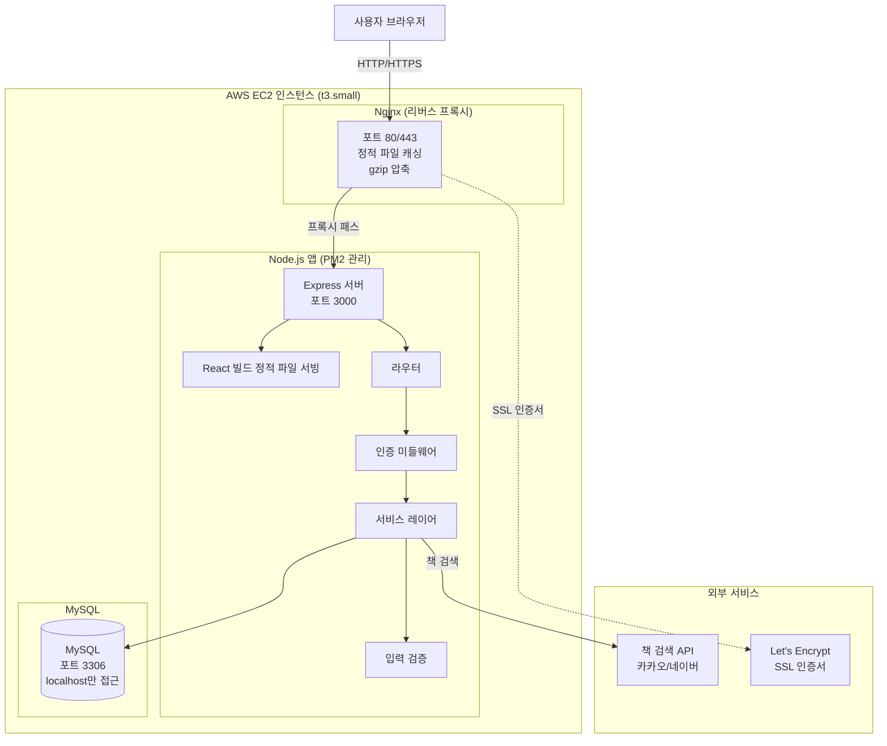
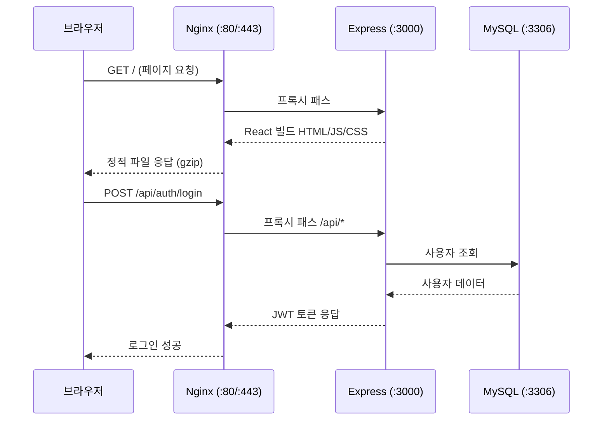
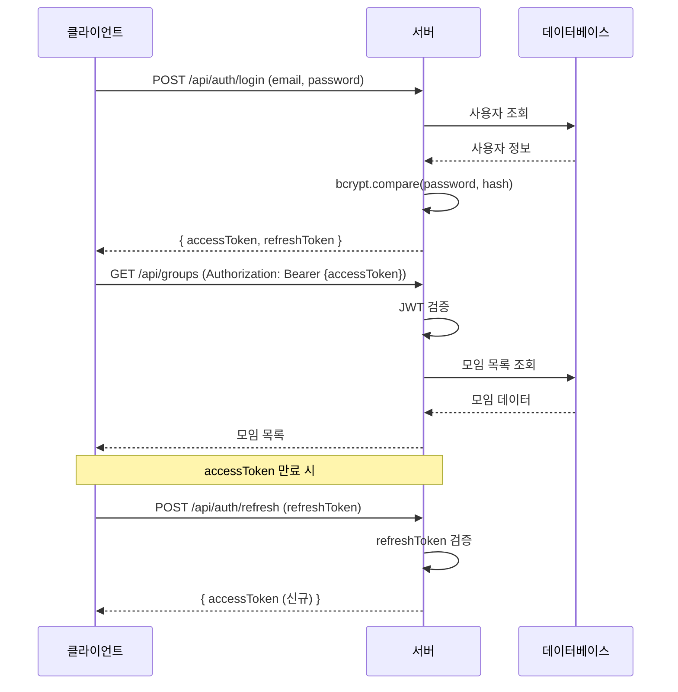
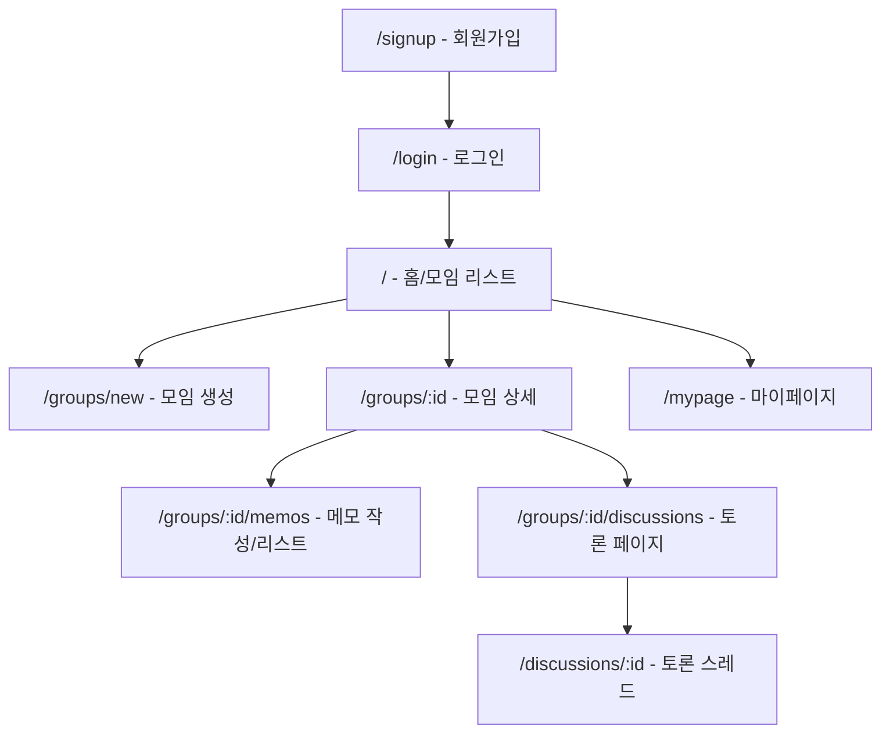
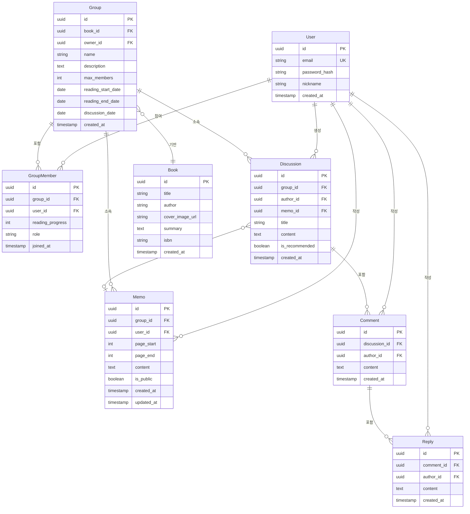

# 기술 설계 문서: 독서 토론 웹사이트

## 개요

독서 토론 웹사이트는 사용자가 독서 중 남긴 메모를 기반으로 자연스럽게 토론에 참여할 수 있는 웹 애플리케이션이다. "기록이 토론 참여로 이어지는가?"라는 핵심 가설을 검증하기 위한 MVP를 구현한다.

시스템은 프론트엔드(React SPA)와 백엔드(REST API 서버)로 구성되며, JWT 기반 인증, 외부 책 검색 API 연동, 메모 기반 토론 주제 추천 기능을 포함한다.

### 핵심 사용자 흐름

```
모임 탐색/생성 → 모임 참여 → 독서 & 메모 작성 → 메모 공유 → 토론 참여
```

## 아키텍처

### 배포 아키텍처: AWS EC2 단일 인스턴스

모든 서비스(Nginx, Node.js, MySQL)를 하나의 EC2 인스턴스에서 운영하는 단일 서버 구조를 채택한다. MVP 단계에서 운영 복잡도를 최소화하고 비용을 절감하기 위한 선택이다.

#### EC2 인스턴스 사양

| 항목 | 권장 사양 |
|------|----------|
| 인스턴스 타입 | t3.small (2 vCPU, 2GB RAM) 이상 |
| OS | Ubuntu 22.04 LTS |
| 스토리지 | EBS gp3 30GB 이상 |
| 리전 | ap-northeast-2 (서울) |

#### 보안 그룹 설정

| 규칙 | 프로토콜 | 포트 | 소스 | 설명 |
|------|---------|------|------|------|
| 인바운드 | TCP | 80 | 0.0.0.0/0 | HTTP |
| 인바운드 | TCP | 443 | 0.0.0.0/0 | HTTPS (SSL 적용 시) |
| 인바운드 | TCP | 22 | 관리자 IP | SSH 접속 |
| 아웃바운드 | 전체 | 전체 | 0.0.0.0/0 | 외부 API 호출 등 |

> MySQL(3306)은 외부에 노출하지 않으며, localhost에서만 접근 가능하도록 설정한다.

### 시스템 구성도



### EC2 내부 서비스 흐름



### 기술 스택

| 영역 | 기술 | 선택 이유 |
|------|------|----------|
| 프론트엔드 | React + TypeScript | 컴포넌트 기반 SPA, 타입 안전성 |
| 상태 관리 | Zustand | 경량, 간단한 API |
| HTTP 클라이언트 | Axios | 인터셉터 기반 토큰 관리 |
| 백엔드 | Node.js + Express + TypeScript | 빠른 개발, 프론트엔드와 언어 통일 |
| ORM | Prisma | 타입 안전한 DB 접근, 마이그레이션 지원 |
| 데이터베이스 | MySQL (EC2 내 직접 설치) | 관계형 데이터 모델에 적합, 단일 서버 운영 |
| 웹서버 | Nginx | 리버스 프록시, 정적 파일 캐싱, gzip 압축 |
| 프로세스 관리 | PM2 | Node.js 프로세스 자동 재시작, 로그 관리 |
| SSL | Let's Encrypt (선택) | 무료 SSL 인증서, certbot 자동 갱신 |
| 인증 | JWT (Access + Refresh Token) | 무상태 인증, 확장성 |
| 비밀번호 해싱 | bcrypt | 업계 표준 |
| 입력 검증 | Zod | TypeScript 네이티브 스키마 검증 |
| 테스트 | Vitest + fast-check | 단위 테스트 + 속성 기반 테스트 |

### 배포 절차 개요

1. EC2 인스턴스 생성 및 보안 그룹 설정
2. 서버 환경 구성: Node.js, MySQL, Nginx, PM2 설치
3. MySQL 데이터베이스 및 사용자 생성
4. 소스 코드 배포 (git clone 또는 scp)
5. `client/` 디렉토리에서 React 빌드 (`npm run build`) → 빌드 결과물을 Express에서 정적 서빙
6. `server/` 디렉토리에서 Prisma 마이그레이션 실행 (`npx prisma migrate deploy`)
7. PM2로 Node.js 서버 시작 (`pm2 start server/dist/index.js`)
8. Nginx 설정: 포트 80 → localhost:3000 프록시 패스
9. (선택) certbot으로 Let's Encrypt SSL 인증서 발급 및 HTTPS 설정

### Nginx 설정 예시

```nginx
server {
    listen 80;
    server_name your-domain.com;

    location / {
        proxy_pass http://127.0.0.1:3000;
        proxy_http_version 1.1;
        proxy_set_header Upgrade $http_upgrade;
        proxy_set_header Connection 'upgrade';
        proxy_set_header Host $host;
        proxy_set_header X-Real-IP $remote_addr;
        proxy_set_header X-Forwarded-For $proxy_add_x_forwarded_for;
        proxy_set_header X-Forwarded-Proto $scheme;
        proxy_cache_bypass $http_upgrade;
    }
}
```

### 인증 흐름



## 컴포넌트 및 인터페이스

### 백엔드 API 엔드포인트

#### 인증 (Auth)

| 메서드 | 경로 | 설명 | 인증 |
|--------|------|------|------|
| POST | `/api/auth/signup` | 회원가입 | 불필요 |
| POST | `/api/auth/login` | 로그인 | 불필요 |
| POST | `/api/auth/refresh` | 토큰 갱신 | refreshToken |

#### 모임 (Groups)

| 메서드 | 경로 | 설명 | 인증 |
|--------|------|------|------|
| GET | `/api/groups` | 모임 목록 조회 (검색 포함) | 필요 |
| POST | `/api/groups` | 모임 생성 | 필요 |
| GET | `/api/groups/:id` | 모임 상세 조회 | 필요 |
| POST | `/api/groups/:id/join` | 모임 참여 | 필요 |

#### 책 검색 (Books)

| 메서드 | 경로 | 설명 | 인증 |
|--------|------|------|------|
| GET | `/api/books/search?q={query}` | 외부 API 책 검색 | 필요 |

#### 메모 (Memos)

| 메서드 | 경로 | 설명 | 인증 |
|--------|------|------|------|
| GET | `/api/groups/:groupId/memos` | 메모 목록 조회 | 필요 |
| POST | `/api/groups/:groupId/memos` | 메모 작성 | 필요 |
| PUT | `/api/memos/:id` | 메모 수정 | 필요 (본인만) |
| DELETE | `/api/memos/:id` | 메모 삭제 | 필요 (본인만) |
| PATCH | `/api/memos/:id/visibility` | 공개 여부 변경 | 필요 (본인만) |

#### 토론 (Discussions)

| 메서드 | 경로 | 설명 | 인증 |
|--------|------|------|------|
| GET | `/api/groups/:groupId/discussions` | 토론 주제 목록 | 필요 |
| POST | `/api/groups/:groupId/discussions` | 토론 주제 생성 | 필요 |
| GET | `/api/discussions/:id/comments` | 의견 목록 조회 | 필요 |
| POST | `/api/discussions/:id/comments` | 의견 작성 | 필요 |
| POST | `/api/comments/:id/replies` | 댓글 작성 | 필요 |
| GET | `/api/groups/:groupId/discussions/recommendations` | 추천 주제 조회 | 필요 |

#### 마이페이지 (My Page)

| 메서드 | 경로 | 설명 | 인증 |
|--------|------|------|------|
| GET | `/api/me/groups` | 참여 모임 목록 | 필요 |
| GET | `/api/me/memos` | 작성 메모 목록 | 필요 |
| GET | `/api/me/discussions` | 참여 토론 목록 | 필요 |

### 프론트엔드 페이지 구조



### 핵심 서비스 인터페이스

```typescript
// 인증 서비스
interface AuthService {
  signup(email: string, password: string, nickname: string): Promise<User>;
  login(email: string, password: string): Promise<{ accessToken: string; refreshToken: string }>;
  refreshToken(refreshToken: string): Promise<{ accessToken: string }>;
  validateToken(token: string): Promise<TokenPayload>;
}

// 모임 서비스
interface GroupService {
  create(data: CreateGroupInput, userId: string): Promise<Group>;
  list(query?: { search?: string; page?: number }): Promise<PaginatedResult<GroupCard>>;
  getDetail(groupId: string, userId: string): Promise<GroupDetail>;
  join(groupId: string, userId: string): Promise<void>;
}

// 메모 서비스
interface MemoService {
  create(groupId: string, userId: string, data: CreateMemoInput): Promise<Memo>;
  update(memoId: string, userId: string, data: UpdateMemoInput): Promise<Memo>;
  delete(memoId: string, userId: string): Promise<void>;
  updateVisibility(memoId: string, userId: string, isPublic: boolean): Promise<Memo>;
  listByGroup(groupId: string, userId: string): Promise<MemoListResult>;
}

// 토론 서비스
interface DiscussionService {
  createTopic(groupId: string, userId: string, data: CreateTopicInput): Promise<Discussion>;
  listTopics(groupId: string, filter?: { authorId?: string }): Promise<Discussion[]>;
  addComment(discussionId: string, userId: string, content: string): Promise<Comment>;
  addReply(commentId: string, userId: string, content: string): Promise<Reply>;
  getRecommendations(groupId: string): Promise<RecommendedTopic[]>;
}

// 책 검색 서비스
interface BookSearchService {
  search(query: string): Promise<BookSearchResult[]>;
}
```


## 데이터 모델

### ER 다이어그램



### 엔티티 상세

#### User (사용자)

| 필드 | 타입 | 제약 조건 | 설명 |
|------|------|----------|------|
| id | UUID | PK | 고유 식별자 |
| email | VARCHAR(255) | UNIQUE, NOT NULL | 이메일 (로그인 ID) |
| password_hash | VARCHAR(255) | NOT NULL | bcrypt 해시된 비밀번호 |
| nickname | VARCHAR(50) | NOT NULL | 닉네임 |
| created_at | TIMESTAMP | NOT NULL, DEFAULT NOW | 가입일 |

#### Book (책)

| 필드 | 타입 | 제약 조건 | 설명 |
|------|------|----------|------|
| id | UUID | PK | 고유 식별자 |
| title | VARCHAR(255) | NOT NULL | 책 제목 |
| author | VARCHAR(255) | | 저자 |
| cover_image_url | TEXT | | 표지 이미지 URL |
| summary | TEXT | | 줄거리 |
| isbn | VARCHAR(20) | | ISBN |
| created_at | TIMESTAMP | NOT NULL, DEFAULT NOW | 등록일 |

#### Group (모임)

| 필드 | 타입 | 제약 조건 | 설명 |
|------|------|----------|------|
| id | UUID | PK | 고유 식별자 |
| book_id | UUID | FK → Book | 대상 책 |
| owner_id | UUID | FK → User | 방장 |
| name | VARCHAR(100) | NOT NULL | 모임명 |
| description | TEXT | | 모임 소개 |
| max_members | INT | NOT NULL, CHECK > 0 | 모집 인원 |
| reading_start_date | DATE | NOT NULL | 독서 시작일 |
| reading_end_date | DATE | NOT NULL | 독서 종료일 |
| discussion_date | DATE | NOT NULL | 토론 날짜 |
| created_at | TIMESTAMP | NOT NULL, DEFAULT NOW | 생성일 |

#### GroupMember (모임 참여자)

| 필드 | 타입 | 제약 조건 | 설명 |
|------|------|----------|------|
| id | UUID | PK | 고유 식별자 |
| group_id | UUID | FK → Group | 모임 |
| user_id | UUID | FK → User | 사용자 |
| reading_progress | INT | DEFAULT 0, CHECK >= 0 | 독서 진행률 (읽은 페이지) |
| role | VARCHAR(20) | NOT NULL, DEFAULT 'member' | 역할 (owner/member) |
| joined_at | TIMESTAMP | NOT NULL, DEFAULT NOW | 참여일 |

**복합 유니크 제약**: (group_id, user_id)

#### Memo (메모)

| 필드 | 타입 | 제약 조건 | 설명 |
|------|------|----------|------|
| id | UUID | PK | 고유 식별자 |
| group_id | UUID | FK → Group | 소속 모임 |
| user_id | UUID | FK → User | 작성자 |
| page_start | INT | NOT NULL, CHECK >= 0 | 읽은 범위 시작 페이지 |
| page_end | INT | NOT NULL, CHECK >= page_start | 읽은 범위 끝 페이지 |
| content | TEXT | NOT NULL | 메모 내용 |
| is_public | BOOLEAN | NOT NULL, DEFAULT FALSE | 공개 여부 |
| created_at | TIMESTAMP | NOT NULL, DEFAULT NOW | 작성일 |
| updated_at | TIMESTAMP | NOT NULL, DEFAULT NOW | 수정일 |

#### Discussion (토론 주제)

| 필드 | 타입 | 제약 조건 | 설명 |
|------|------|----------|------|
| id | UUID | PK | 고유 식별자 |
| group_id | UUID | FK → Group | 소속 모임 |
| author_id | UUID | FK → User | 작성자 |
| memo_id | UUID | FK → Memo, NULLABLE | 참조 메모 |
| title | VARCHAR(200) | NOT NULL | 주제 제목 |
| content | TEXT | | 주제 내용 |
| is_recommended | BOOLEAN | NOT NULL, DEFAULT FALSE | 추천 주제 여부 |
| created_at | TIMESTAMP | NOT NULL, DEFAULT NOW | 생성일 |

#### Comment (의견)

| 필드 | 타입 | 제약 조건 | 설명 |
|------|------|----------|------|
| id | UUID | PK | 고유 식별자 |
| discussion_id | UUID | FK → Discussion | 소속 토론 |
| author_id | UUID | FK → User | 작성자 |
| content | TEXT | NOT NULL | 의견 내용 |
| created_at | TIMESTAMP | NOT NULL, DEFAULT NOW | 작성일 |

#### Reply (댓글)

| 필드 | 타입 | 제약 조건 | 설명 |
|------|------|----------|------|
| id | UUID | PK | 고유 식별자 |
| comment_id | UUID | FK → Comment | 상위 의견 |
| author_id | UUID | FK → User | 작성자 |
| content | TEXT | NOT NULL | 댓글 내용 |
| created_at | TIMESTAMP | NOT NULL, DEFAULT NOW | 작성일 |

### 입력 검증 스키마 (Zod)

```typescript
// 회원가입
const SignupSchema = z.object({
  email: z.string().email("올바른 이메일 형식이 아닙니다"),
  password: z.string().min(8, "비밀번호는 8자 이상이어야 합니다"),
  nickname: z.string().min(1).max(50),
});

// 모임 생성
const CreateGroupSchema = z.object({
  bookId: z.string().uuid().optional(),
  bookTitle: z.string().min(1, "책 제목을 입력해주세요"),
  bookAuthor: z.string().optional(),
  bookCoverUrl: z.string().url().optional(),
  bookSummary: z.string().optional(),
  name: z.string().min(1, "모임명을 입력해주세요"),
  description: z.string().optional(),
  maxMembers: z.number().int().positive("모집 인원은 1명 이상이어야 합니다"),
  readingStartDate: z.string().date(),
  readingEndDate: z.string().date(),
  discussionDate: z.string().date(),
});

// 메모 작성
const CreateMemoSchema = z.object({
  pageStart: z.number().int().nonnegative(),
  pageEnd: z.number().int().nonnegative(),
  content: z.string().min(1, "메모 내용을 입력해주세요"),
  isPublic: z.boolean().default(false),
}).refine(data => data.pageEnd >= data.pageStart, {
  message: "끝 페이지는 시작 페이지 이상이어야 합니다",
});

// 토론 주제 생성
const CreateDiscussionSchema = z.object({
  title: z.string().min(1, "토론 주제를 입력해주세요"),
  content: z.string().optional(),
  memoId: z.string().uuid().optional(),
});
```


## 정확성 속성 (Correctness Properties)

*속성(Property)이란 시스템의 모든 유효한 실행에서 참이어야 하는 특성 또는 동작이다. 속성은 사람이 읽을 수 있는 명세와 기계가 검증할 수 있는 정확성 보장 사이의 다리 역할을 한다.*

### Property 1: 회원가입-로그인 라운드트립

*임의의* 유효한 이메일과 8자 이상 비밀번호로 회원가입한 후, 동일한 자격 증명으로 로그인하면 유효한 인증 토큰이 발급되어야 한다.

**Validates: Requirements 1.1, 2.1**

### Property 2: 중복 이메일 회원가입 거부

*임의의* 이메일에 대해, 해당 이메일로 회원가입이 완료된 후 동일한 이메일로 다시 회원가입을 시도하면 항상 거부되어야 한다.

**Validates: Requirements 1.2**

### Property 3: 짧은 비밀번호 거부

*임의의* 8자 미만 문자열을 비밀번호로 사용하여 회원가입을 시도하면 항상 거부되어야 한다.

**Validates: Requirements 1.3**

### Property 4: 잘못된 자격 증명 로그인 거부

*임의의* 등록된 사용자에 대해, 올바르지 않은 비밀번호로 로그인을 시도하면 항상 거부되어야 한다.

**Validates: Requirements 2.2**

### Property 5: 토큰 유효성에 따른 접근 제어

*임의의* API 요청에 대해, 유효한 토큰이 포함되면 인증이 성공하고, 만료되거나 유효하지 않은 토큰이 포함되면 401 응답이 반환되어야 한다.

**Validates: Requirements 2.3, 2.4**

### Property 6: 모임 생성 라운드트립

*임의의* 유효한 모임 데이터(책 제목, 모임명, 모집 인원, 독서 기간, 토론 날짜 포함)로 모임을 생성하면, 해당 모임을 조회했을 때 동일한 데이터가 반환되어야 한다.

**Validates: Requirements 3.4**

### Property 7: 모임 생성 시 필수 항목 검증

*임의의* 모임 생성 입력에서 필수 항목(책 제목, 모임명, 모집 인원, 독서 기간, 토론 날짜) 중 하나 이상이 누락되면 항상 거부되어야 한다.

**Validates: Requirements 3.5**

### Property 8: 모임 생성자는 방장이자 첫 번째 참여자

*임의의* 모임을 생성한 후 참여자 목록을 조회하면, 생성자가 'owner' 역할로 참여자 목록에 포함되어 있어야 한다.

**Validates: Requirements 3.6**

### Property 9: 모임 카드 필수 정보 포함

*임의의* 모임에 대해, 모임 목록 API가 반환하는 모임 카드에는 책 제목, 줄거리, 모임 소개, 독서 기간, 토론 날짜, 참여 인원 수가 모두 포함되어야 한다.

**Validates: Requirements 4.2**

### Property 10: 모임 검색 결과 정확성

*임의의* 검색어로 모임을 검색하면, 반환된 모든 모임의 책 제목에 해당 검색어가 포함되어야 한다.

**Validates: Requirements 4.3**

### Property 11: 모임 참여 후 참여자 목록 포함

*임의의* 사용자가 *임의의* 모임에 참여하면, 해당 모임의 참여자 목록에 해당 사용자가 포함되어야 한다.

**Validates: Requirements 5.1**

### Property 12: 모집 인원 초과 참여 차단

*임의의* 모임에서 참여 인원이 모집 인원에 도달한 상태에서 새로운 사용자가 참여를 시도하면 항상 거부되어야 한다.

**Validates: Requirements 5.2**

### Property 13: 중복 참여 차단

*임의의* 사용자가 이미 참여 중인 모임에 다시 참여를 시도하면 항상 거부되어야 한다.

**Validates: Requirements 5.3**

### Property 14: 독서 진행률 업데이트 라운드트립

*임의의* 참여자의 독서 진행률을 업데이트한 후 조회하면, 업데이트한 값과 동일한 값이 반환되어야 한다.

**Validates: Requirements 6.2**

### Property 15: 메모 저장 라운드트립

*임의의* 유효한 메모 데이터(읽은 범위, 내용, 공개 여부)로 메모를 작성한 후 조회하면, 동일한 데이터가 반환되어야 한다.

**Validates: Requirements 7.1**

### Property 16: 빈 메모 내용 거부

*임의의* 빈 문자열 또는 공백만으로 구성된 문자열을 메모 내용으로 제출하면 항상 거부되어야 한다.

**Validates: Requirements 7.2**

### Property 17: 메모 기본 공개 여부는 비공개

*임의의* 메모를 공개 여부를 명시하지 않고 생성하면, 해당 메모의 is_public 값은 false여야 한다.

**Validates: Requirements 7.3**

### Property 18: 메모 업데이트 반영

*임의의* 메모에 대해, 내용 또는 공개 여부를 수정한 후 조회하면 수정된 값이 반환되어야 한다.

**Validates: Requirements 8.1, 8.3**

### Property 19: 메모 삭제 후 목록에서 제거

*임의의* 메모를 삭제한 후 메모 목록을 조회하면, 해당 메모가 목록에 포함되지 않아야 한다.

**Validates: Requirements 8.2**

### Property 20: 타인 메모 수정/삭제 권한 차단

*임의의* 두 사용자 A, B에 대해, A가 작성한 메모를 B가 수정하거나 삭제하려고 시도하면 항상 거부되어야 한다.

**Validates: Requirements 8.4**

### Property 21: 메모 목록에서 본인 메모와 공개 메모 구분

*임의의* 참여자가 메모 목록을 조회하면, 본인의 전체 메모(공개+비공개)와 타인의 공개 메모만 반환되어야 하며, 타인의 비공개 메모는 포함되지 않아야 한다.

**Validates: Requirements 9.1**

### Property 22: 독서 진행률 기반 메모 열람 제어

*임의의* 참여자와 *임의의* 공개 메모에 대해, 참여자의 독서 진행률(읽은 페이지)이 메모의 page_end보다 낮으면 메모 내용이 숨겨지고, page_end 이상이면 전체 내용이 열람 가능해야 한다.

**Validates: Requirements 9.2, 9.3**

### Property 23: 토론 주제 생성 라운드트립

*임의의* 유효한 토론 주제 데이터(제목, 내용)로 토론 주제를 생성한 후 조회하면, 동일한 데이터가 반환되어야 한다.

**Validates: Requirements 10.1**

### Property 24: 메모-토론 주제 참조 연결

*임의의* 메모를 토론 주제에 연결하면, 해당 토론 주제를 조회했을 때 원본 메모 ID가 참조로 포함되어야 한다.

**Validates: Requirements 10.2**

### Property 25: 빈 토론 주제 제목 거부

*임의의* 빈 문자열을 토론 주제 제목으로 제출하면 항상 거부되어야 한다.

**Validates: Requirements 10.3**

### Property 26: 스레드 글 작성 라운드트립

*임의의* 의견 또는 댓글을 작성한 후 해당 스레드를 조회하면, 작성한 내용이 올바른 위치(의견은 토론 하위, 댓글은 의견 하위)에 포함되어야 한다.

**Validates: Requirements 11.2, 11.3**

### Property 27: 작성자 필터 정확성

*임의의* 참여자 ID로 토론 작성 내역을 필터링하면, 반환된 모든 항목의 작성자가 해당 참여자여야 한다.

**Validates: Requirements 11.4**

### Property 28: 공개 메모 기반 추천 주제 생성 조건

*임의의* 모임에서 공개 메모가 2개 이상 존재하면 추천 엔진이 1개 이상의 토론 주제 후보를 생성해야 하고, 2개 미만이면 추천 주제가 생성되지 않아야 한다.

**Validates: Requirements 12.1**

### Property 29: 추천 주제 선택 시 토론 스레드 자동 생성

*임의의* 추천 주제를 선택하면, 해당 추천 주제를 기반으로 새로운 토론 주제가 생성되고 is_recommended가 true로 설정되어야 한다.

**Validates: Requirements 12.3**

### Property 30: 마이페이지 활동 데이터 완전성

*임의의* 사용자가 모임 참여, 메모 작성, 토론 참여를 수행한 후 마이페이지를 조회하면, 해당 활동이 모두 각각의 목록에 포함되어야 한다.

**Validates: Requirements 13.1**


## 에러 처리

### HTTP 에러 응답 형식

모든 API 에러 응답은 일관된 형식을 따른다:

```typescript
interface ErrorResponse {
  error: {
    code: string;       // 머신 리더블 에러 코드
    message: string;    // 사용자 표시용 메시지
  };
}
```

### 에러 코드 체계

| HTTP 상태 | 에러 코드 | 설명 | 사용 위치 |
|-----------|----------|------|----------|
| 400 | `VALIDATION_ERROR` | 입력 검증 실패 | 모든 입력 검증 |
| 400 | `EMPTY_CONTENT` | 필수 텍스트 필드가 비어 있음 | 메모 내용, 토론 제목 |
| 401 | `INVALID_CREDENTIALS` | 이메일/비밀번호 불일치 | 로그인 |
| 401 | `TOKEN_EXPIRED` | 인증 토큰 만료 | 인증 미들웨어 |
| 401 | `INVALID_TOKEN` | 유효하지 않은 토큰 | 인증 미들웨어 |
| 403 | `FORBIDDEN` | 권한 없음 (타인 메모 수정 등) | 메모 수정/삭제 |
| 404 | `NOT_FOUND` | 리소스를 찾을 수 없음 | 모든 상세 조회 |
| 409 | `DUPLICATE_EMAIL` | 이미 등록된 이메일 | 회원가입 |
| 409 | `ALREADY_JOINED` | 이미 참여 중인 모임 | 모임 참여 |
| 409 | `GROUP_FULL` | 모집 인원 마감 | 모임 참여 |
| 502 | `EXTERNAL_API_ERROR` | 외부 API 호출 실패 | 책 검색 |

### 에러 처리 전략

#### 백엔드

1. **입력 검증**: Zod 스키마를 통한 요청 데이터 검증. 검증 실패 시 400 응답과 구체적인 오류 메시지 반환.
2. **인증 에러**: JWT 미들웨어에서 토큰 검증 실패 시 401 응답. 프론트엔드에서 refresh 토큰으로 재시도.
3. **권한 에러**: 서비스 레이어에서 리소스 소유자 확인. 불일치 시 403 응답.
4. **외부 API 에러**: 책 검색 API 실패 시 502 응답. 프론트엔드에서 수동 입력 모드로 전환.
5. **예상치 못한 에러**: 글로벌 에러 핸들러에서 500 응답. 에러 로그 기록.

#### 프론트엔드

1. **Axios 인터셉터**: 401 응답 시 자동으로 토큰 갱신 시도. 갱신 실패 시 로그인 페이지로 리다이렉트.
2. **폼 검증 에러**: 서버 응답의 에러 메시지를 해당 입력 필드 하단에 표시.
3. **네트워크 에러**: "네트워크 연결을 확인해주세요" 토스트 메시지 표시.
4. **외부 API 에러**: 책 검색 실패 시 수동 입력 UI로 자동 전환.

## 테스트 전략

### 이중 테스트 접근법

본 프로젝트는 단위 테스트와 속성 기반 테스트를 병행하여 포괄적인 테스트 커버리지를 확보한다.

### 단위 테스트 (Vitest)

단위 테스트는 구체적인 예시, 엣지 케이스, 에러 조건에 집중한다.

**테스트 대상:**
- Zod 스키마 검증 (유효/무효 입력 예시)
- 서비스 레이어 비즈니스 로직 (모임 참여 조건, 메모 권한 확인 등)
- 인증 미들웨어 (토큰 검증, 만료 처리)
- 외부 API 연동 (모킹을 통한 성공/실패 시나리오)
- 메모 열람 제한 로직 (진행률 기반 접근 제어)
- 추천 엔진 (공개 메모 수 기반 추천 생성 조건)

**엣지 케이스:**
- 책 검색 API 실패 시 수동 입력 모드 전환 (요구사항 3.3)
- 빈 검색 결과 처리 (요구사항 4.4)
- 모임 상세 페이지 데이터 구성 (요구사항 6.1, 6.3)

### 속성 기반 테스트 (fast-check)

속성 기반 테스트는 설계 문서의 정확성 속성을 검증한다. 각 테스트는 최소 100회 반복 실행한다.

**테스트 라이브러리:** fast-check (TypeScript 네이티브 PBT 라이브러리)

**구성:**
- 각 속성 테스트는 최소 100회 반복 (`numRuns: 100`)
- 각 테스트에 설계 문서 속성 참조 태그 포함
- 태그 형식: `Feature: book-discussion-website, Property {번호}: {속성 설명}`

**속성 테스트 목록:**

| 속성 번호 | 테스트 설명 | 생성기 |
|-----------|-----------|--------|
| 1 | 회원가입-로그인 라운드트립 | 유효한 이메일, 8자+ 비밀번호 |
| 2 | 중복 이메일 거부 | 임의의 이메일 |
| 3 | 짧은 비밀번호 거부 | 1~7자 문자열 |
| 4 | 잘못된 자격 증명 거부 | 등록된 이메일 + 다른 비밀번호 |
| 5 | 토큰 유효성 접근 제어 | 유효/만료/무효 토큰 |
| 6 | 모임 생성 라운드트립 | 유효한 모임 데이터 |
| 7 | 모임 필수 항목 검증 | 필수 항목 부분 누락 데이터 |
| 8 | 모임 생성자 방장 등록 | 유효한 모임 데이터 + 사용자 |
| 9 | 모임 카드 필수 정보 | 임의의 모임 |
| 10 | 모임 검색 정확성 | 임의의 검색어 + 모임 데이터 |
| 11 | 모임 참여 후 목록 포함 | 임의의 사용자 + 모임 |
| 12 | 모집 인원 초과 차단 | 가득 찬 모임 + 새 사용자 |
| 13 | 중복 참여 차단 | 이미 참여한 사용자 + 모임 |
| 14 | 독서 진행률 라운드트립 | 임의의 진행률 값 |
| 15 | 메모 저장 라운드트립 | 유효한 메모 데이터 |
| 16 | 빈 메모 거부 | 공백 문자열 |
| 17 | 메모 기본 비공개 | 공개 여부 미지정 메모 |
| 18 | 메모 업데이트 반영 | 임의의 수정 데이터 |
| 19 | 메모 삭제 후 제거 | 임의의 메모 |
| 20 | 타인 메모 권한 차단 | 두 사용자 + 메모 |
| 21 | 메모 목록 공개/비공개 구분 | 여러 사용자 + 공개/비공개 메모 |
| 22 | 진행률 기반 열람 제어 | 임의의 진행률 + 메모 범위 |
| 23 | 토론 주제 라운드트립 | 유효한 토론 데이터 |
| 24 | 메모-토론 참조 연결 | 메모 + 토론 주제 |
| 25 | 빈 토론 제목 거부 | 빈 문자열 |
| 26 | 스레드 글 작성 라운드트립 | 의견/댓글 데이터 |
| 27 | 작성자 필터 정확성 | 여러 참여자 + 작성 내역 |
| 28 | 추천 주제 생성 조건 | 공개 메모 0~N개 |
| 29 | 추천 주제 선택 시 스레드 생성 | 추천 주제 |
| 30 | 마이페이지 활동 완전성 | 사용자 활동 데이터 |

**각 속성 테스트는 단일 property-based test로 구현한다.**

### 테스트 실행

```bash
# 전체 테스트 실행
npx vitest --run

# 속성 기반 테스트만 실행
npx vitest --run --grep "Property"
```
